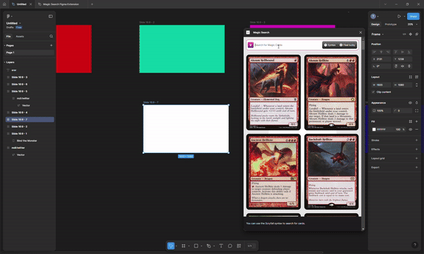

# MTG (Magic The Gathering) cards searcher for Figma

## About 
This plugin is for MTG fans who want to make Figma project around the famous MTG game. 
The plugin is used to insert MTG cards directly to Figma without leaving the software.
## Features
- [x] Search any MTG cards
- [x] Insert selected cards to current page  
  - [x] creates an auto layout frame if multiple cards are inserted
  - [x] selected cards are inserted inside the selected frame or group
- [ ] Handle Scryfall syntax for specific search
- [ ] I am feel lucky feature
## Development guide

*This plugin is built with [Create Figma Plugin](https://yuanqing.github.io/create-figma-plugin/).*

### Pre-requisites

- [Node.js](https://nodejs.org) – v20
- [Figma desktop app](https://figma.com/downloads/)

### Build the plugin

To build the plugin:

```
$ npm run build
```

This will generate a [`manifest.json`](https://figma.com/plugin-docs/manifest/) file and a `build/` directory containing the JavaScript bundle(s) for the plugin.

To watch for code changes and rebuild the plugin automatically:

```
$ npm run watch
```

### Install the plugin

1. In the Figma desktop app, open a Figma document.
2. Search for and run `Import plugin from manifest…` via the Quick Actions search bar.
3. Select the `manifest.json` file that was generated by the `build` script.

### Debugging

Use `console.log` statements to inspect values in your code.

To open the developer console, search for and run `Show/Hide Console` via the Quick Actions search bar.

## See also

- [Create Figma Plugin docs](https://yuanqing.github.io/create-figma-plugin/)
- [`yuanqing/figma-plugins`](https://github.com/yuanqing/figma-plugins#readme)

Official docs and code samples from Figma:

- [Plugin API docs](https://figma.com/plugin-docs/)
- [`figma/plugin-samples`](https://github.com/figma/plugin-samples#readme)
